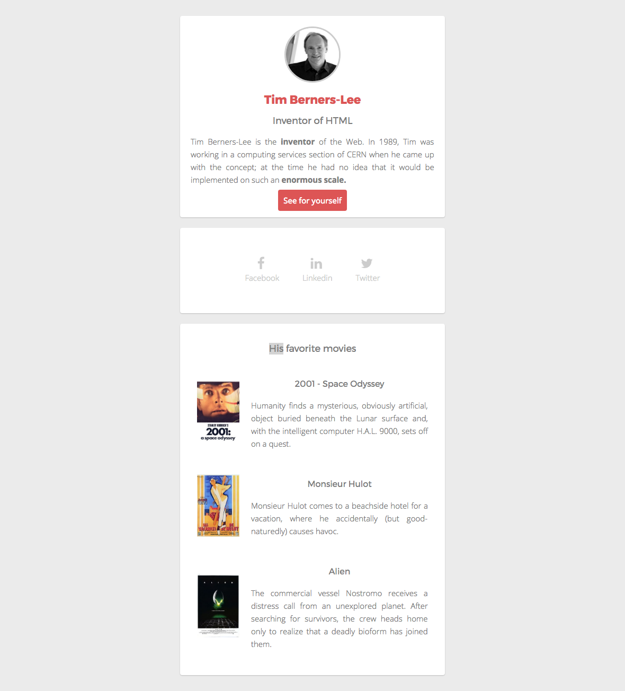

# Pixels-perfect
Copy cat a landing page

## Presentation du projet

-   Nom du projet : Pixel Perfect
-   Autreur : [Nordine Becode](https://github.com/ElazzouziNordineBeCode) - [Repository](https://github.com/ElazzouziNordineBeCode/Pixels-perfect)
-   Formation réaliser chez : [BeCode](https://becode.org/) à [BeCentral](https://becode.org/fr/a-propos-de-nous/nos-campus/bruxelles/) Bruxelles.
-   Instructeur : [Mike](https://github.com/Mike00001)

## Pourquoi se Repository ?

Dans le cadre d'un exercice, fait au cours de ma formation pour devenir Fulle Stack Junior Developper, il nous a êtes demander d'exécuter plusieurs actions pour vérifier nos aquis.

Pour cela, j'ai créer une copie parfaite d'une landing page fournis au format PNG. Voici le PNG qui nous a servie de model :

